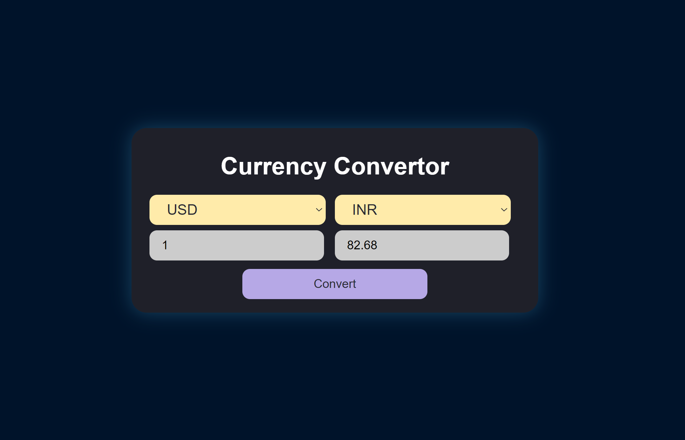

# TECHNOHACKS-CURRENCY-CONVERTOR
Repository showcasing my completed projects and tasks during my Web Development internship at TECHNOHACKS. Here, you'll find the code and documentation for the various assignments and projects I worked on, demonstrating my growth and skills as a Java intern at TECHNOHACKS.

## TASK 4 CURRENCY CONVERTER

This repository contains a simple Currency converter web application project developed using HTML, CSS, and JavaScript, created as part of my internship at TECHNOHACKS

## Overview:
The Currency Converter project is a web application that enables users to convert between different currencies. It utilizes HTML, CSS, JavaScript, and the Frankfurter Currency Converter API to provide real-time exchange rate information and facilitate currency conversions. Users can select source and target currencies, enter the amount they want to convert, and instantly see the converted amount. This project offers a user-friendly interface for convenient currency conversion.



## Features

- Convert between different currencies.
- Real-time exchange rate updates using the Frankfurter Currency Converter API.
- User-friendly interface with clear input and output sections.
- Cross-platform compatibility (works on desktop and mobile devices).

## Usage
- Clone or download this repository to your local machine.
- Open the `index.html` file in your web browser.


## Getting Started

To get started with the Currency Converter web application, follow these steps:

1. Clone the repository to your local machine:

   ```bash
   git clone https://github.com/HariR1893/TECHNOHACKS-CURRENCY-CONVERTOR.git
   ```
2. Navigate to the project directory:
   `cd TECHNOHACKS-CURRENCY-CONVERTOR`

3. Start the development server:
    `npm run start`
   
5. The app will open in your default web browser at `http://localhost:3000.`

Feel free to explore and customize this project as you see fit. It's a great way to gain practical experience in web development during your internship at TECHNOHACKS!
